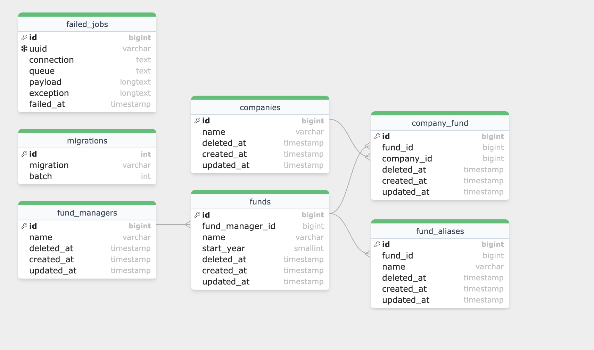

## Running the project
To speed up I'm using Laravel Sail that's a docker development environment
https://laravel.com/docs/10.x/sail#introduction

### Starting the project
After cloning the repo to your machine and turn on the docker app, run the command below

```
docker run --rm \
    -u "$(id -u):$(id -g)" \
    -v "$(pwd):/var/www/html" \
    -w /var/www/html \
    laravelsail/php82-composer:latest \
    composer install --ignore-platform-reqs
```

```
# To start all of the Docker containers in the background, you may start Sail in "detached" mode:
./vendor/bin/sail up -d
```

### Migrate the database with some values
```shell
sail artisan migrate --step --seed
# or make a full refresh
sail artisan migrate:refresh --seed
```
### Running tests
```
sail artisan test
```

## Api's

| Api         | Type | Route                                |  Parameters            |
|-------------|------|--------------------------------------|------------------------|
| List funds  | GET  | http://localhost/api/funds           | name, year, fund_manager |
| Update fund | PUT  | http://localhost/api/funds/{fund_id} | name,aliases(array of names), start_year, fund_manager_id, companies(array of ids)|

## Diagram


